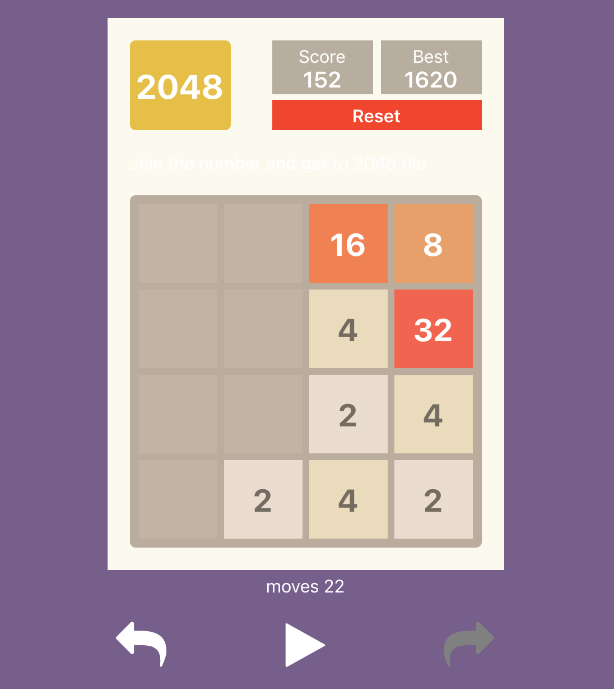

## Famous 2048 Game (Reactjs)


<p  align="center"></p>

## To Test winner

you can change variable `WIN_SCORE` in `src/const.js` to change the target number for win

### Steps to Run

1. Clone this repository
	```
	git clone https://github.com/piya03/react-2048-game.git
	```

2.  Run 
	```
	 yarn install
	```
3.  Run
	```
	yarn start
	```

### Technologies Used

 - Reactjs (hooks)


### Usecases Handled

1.  undo, redo and replay
2.  Playable using the arrow keys of the keyboard.
3. The basic rules & conventions of the 2048 game should be followed.
4. The best score and current score get tracked.
5. Persist the state of app on reload
6. An UNDO button, that undoes the last move. If there are no last moves it will be
disabled.
7. A REDO button that redoes the movie. If there are no moves to redo, it will be disabled.
8. A REPLAY button that basically auto plays the game from the first move to the most recent
move. When starting the game, the Replay button will be disabled.
9. The Replay will have a timeout of 2 seconds between each move, which will be configurable.
10. When Replay is in progress, no new moves are allowed.
11. Added a reset button to the UI, which will essentially restart the game from scratch.
12. When the game is won , a modal will be shown showing success message.
13. Keep a track of moves also
